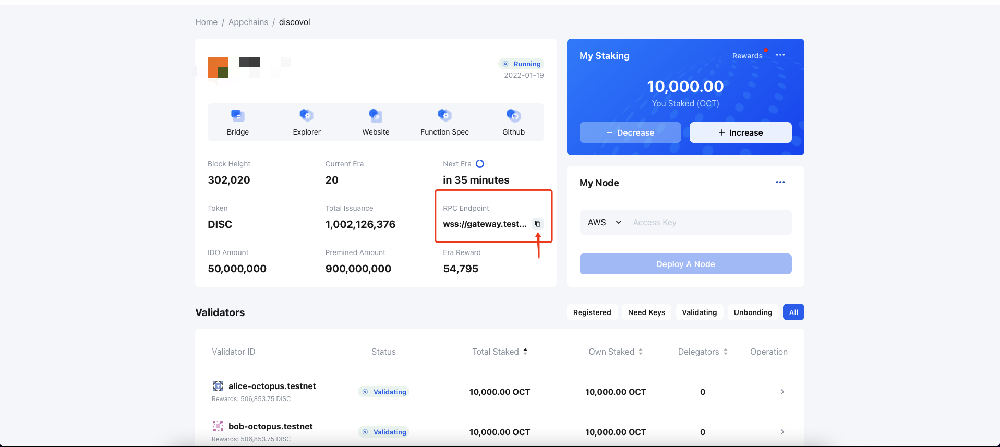
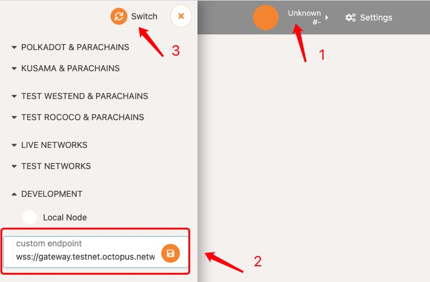

## 生成验证人帐户

每个验证人都必须有一个 NEAR 账户和一个应用链的账户，前者用于进行质押 OCT 的操作，后者用设置会话密钥及管理应用链的资产。

> 创建 NEAR 账户的方法，请参考[创建 NEAR 账户](https://docs.near.org/zh-CN/docs/develop/basics/create-account)

本节介绍了3种生成验证人应用链帐户的方式。无论选择哪种方式，请务必记下本节中的所有输出，以备日后使用。

### 选项1：Polkadot{.js} 浏览器插件

这种方式**推荐给大多数用户**。

Polkadot{.js} 浏览器插件是一个简单的浏览器扩展工具，用户可用来管理其的帐户，以及使用帐户进行交易签名。

使用[Polkadot{.js}浏览器插件](https://wiki.polkadot.network/docs/en/learn-account-generation#polkadotjs-browser-plugin)生成应用链的帐户。

### 选项2：Subkey

这种方式更**适用于进阶用户更安全**。

Subkey 是个 Substrate 命令行程序，用于生成或还原 Substrate 密钥。对于那些熟悉命令行和 Rust 代码编译的高级技术用户，建议使用它。对于一般用户，则不建议使用。

有关 Subkey 的详细使用说明，请参见[README文档](https://github.com/paritytech/substrate/tree/master/bin/utils/subkey)。

### 选项3：PolkadotJS-Apps

通过以下步骤创建验证人应用链帐户：

#### 1. 获取应用链的 RPC

访问章鱼网络([Mainnet](https://mainnet.oct.network) 和 [Testnet](https://testnet.oct.network))，选择`Appchains`选项，进入应用链列表页面，从应用链页面可以获取应用链的 RPC Endpoint。

#### 2. 设置 PolkadotJS Apps

进入[Polkadot Apps](https://polkadot.js.org/apps/#/explorer)，用上一步中的 RPC Endpoint 设置自定义 RPC，即可连接到应用链网络。

#### 3. 创建应用链账户

连接到网络后，即可创建新帐户。

