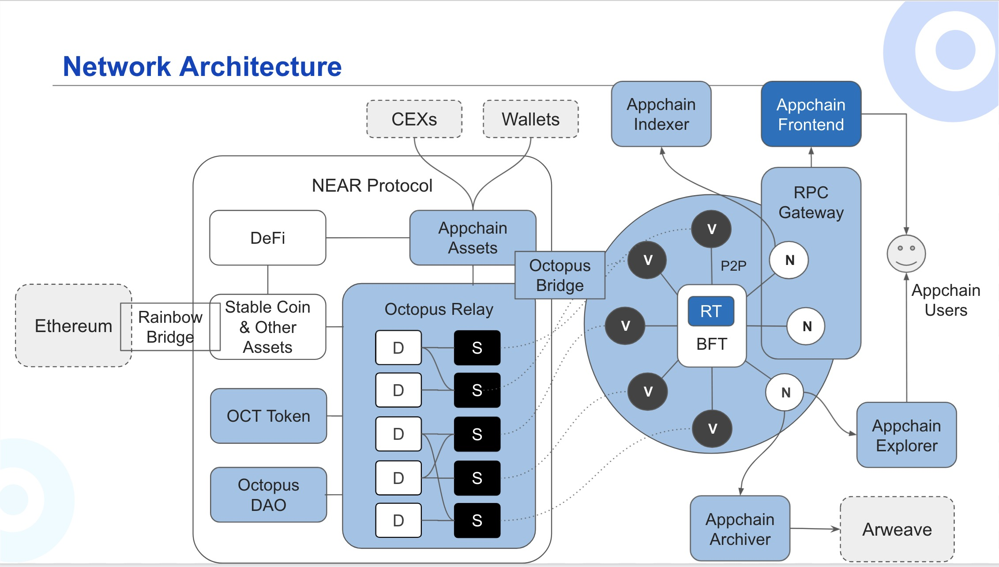

## Overview of Octopus Network

Octopus Network is a brand new multichain network born to serve application-specific blockchains, aka Appchain. Octopus Network provides flexible and affordable leased security, out-of-box cross-chain interoperability, one-stop infrastructure, and a ready-to-be-engaged community for the appchains.

The full name of abbreviations in the architecture diagram:

| Abbreviations | Full Name  |
|------|------|
| D | Delegator |
| S | Staking |
| V | Validator, a node involved in staking |
| RT | Runtime |
| N | Node | 

### Octopus Relay

Octopus Relay is the core of the Octopus Network — a set of  [smart contracts](https://github.com/octopus-network/octopus-relay-contract) running on the NEAR blockchain, aka mainchain, that implements the security leasing market.

### Appchain

An Octopus Appchain is a Substrate-based blockchain that is made for a specific decentralized application. Once integrating the pallet [pallet-octopus-appchain](https://github.com/octopus-network/pallet-octopus-appchain), the Appchain will be geared up to anchor off the Octopus Network.

### Validator

In the Octopus Network, OCT holders can stake OCTs to become validators or delegators. Validators secure Appchains by staking OCT and [running the validator nodes](../maintain/validator-guide.md) of the Appchain. Delegators secure Appchains by delegating the OCT they stake to honest validators.

The validators are rewarded with the native token of the corresponding Appchains by validating cross-chain transactions and blocks. If a validator misbehaves (e.g. be offline, attacks the network, or runs malware) in the network, the staked OCT of both the validator and its delegators will be slashed proportionally.
