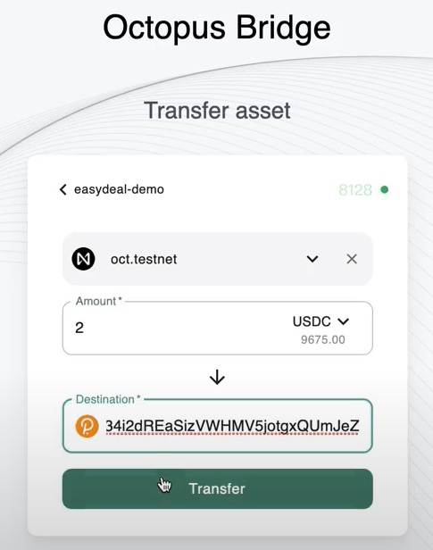

## Transfer Mainchain Stablecoin 

Octopus Network provides out-of-the-box cross-chain functions for Appchains, including mainchain (NEAR) stablecoin transfer and Appchain native asset transfer.

This guide describes how to transfer the mainchain's stablecoin through Octopus' built-in cross-chain function. 

* Create stablecoin's wrapper asset on Appchain
* Transfer stablecoin to Appchain
* Transfer stablecoin's wrapper asset to mainchain from Appchain


### Create Wrapper Assets

After the Appchain goes live, if Appchain users want to use a stable coin on the mainchain, such as USDC, we need to create the corresponding wrapper asset on the Appchain first. Usually, this step is done through the governance of the Appchain. However, we use `sudo` instead to demo.

* Connect to the Appchain on Polkadot JS. 
* Set the custom type, select `Settings -> Developer`, add the following JSON content and save it:

```json
{
  "Validator": {
    "id": "AccountId",
    "weight": "u128"
  },
  "ValidatorSet": {
    "sequence_number": "u32",
    "set_id": "u32",
    "validators": "Vec<Validator>"
  },
  "LockEvent": {
    "sequence_number": "u32",
    "token_id": "Vec<u8>",
    "sender_id": "Vec<u8>",
    "receiver": "AccountId",
    "amount": "u128"
  },
  "AssetIdOf": "u32",
  "AssetBalanceOf": "u128",
  "TAssetBalance": "u128",
  "Observation": {
    "_enum": {
      "UpdateValidatorSet": "(ValidatorSet)",
      "LockToken": "(LockEvent)"
    }
  }
}
```


* Select `Develper -> Sudo -> asserts -> forceCreate` to issue an asset with asset ID 0:


* Check the chain status if the asset was issued correctly, where Asset 0 corresponds to the stable coin USDC on the mainchain (we have this mapping preset in ChainSpec, `usdc.testnet`).


### Transfer Mainchain to Appchain

On the [cross-chain bridge](https://bridge.testnet.oct.network/) of Octopus Test Network, we select the Appchain `easydeal-demo` which will receive the stablecoin USDC  transferred from the mainchain and the account `oct.testnet` as the sender; The recipient is an SS58 address of an Appchain account, which will receive the 2 USDC after transferred.



A few minutes later, the transfer transaction is verified by the Appchain validators, then the corresponding wrapped assets are minted for the recipient. We can check the chain state to verify if the assets are transferred correctly by selecting `Chain State -> Storage -> asserts -> account` and the balance should be 2,000,000 units(note: the decimal place is 6).


### Transfer Back to the Mainchain from Appchain

Following to the previous operation, we switch the sender and receiver accounts to transfer the stablecoin asset back.


The asset balance will be updated after the transfer back event is verified by Octopus Relay on the mainchain.
